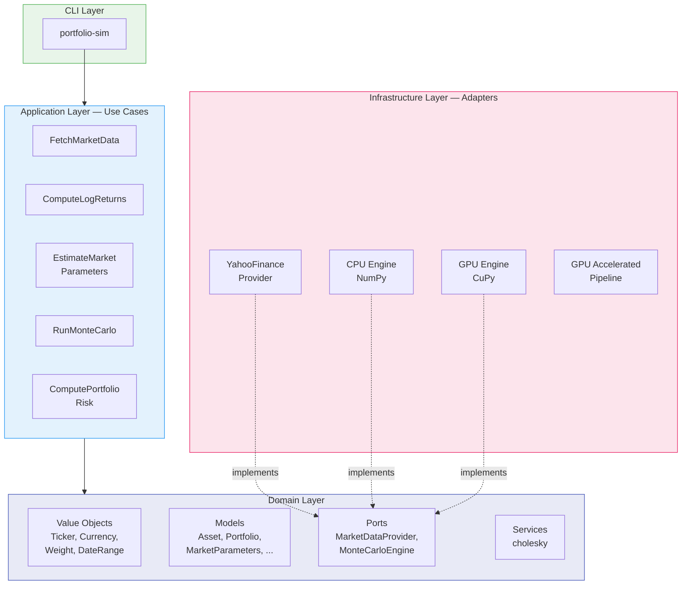

# Monte Carlo Portfolio Risk Engine (GPU Accelerated)

| | |
| --- | --- |
| CI/CD | [](https://github.com/romain-blanchot/montecarlo-portfolio-risk-gpu/actions/workflows/ci.yml) [](https://github.com/romain-blanchot/montecarlo-portfolio-risk-gpu/actions/workflows/cd.yml) [](https://github.com/romain-blanchot/montecarlo-portfolio-risk-gpu/actions/workflows/release.yml) |
| Docs | [](https://github.com/romain-blanchot/montecarlo-portfolio-risk-gpu/actions/workflows/docs.yml) |
| Quality | [](https://sonarcloud.io/summary/new_code?id=romain-blanchot_montecarlo-portfolio-risk-gpu) [](https://sonarcloud.io/summary/new_code?id=romain-blanchot_montecarlo-portfolio-risk-gpu) [](https://sonarcloud.io/summary/new_code?id=romain-blanchot_montecarlo-portfolio-risk-gpu) [](https://sonarcloud.io/summary/new_code?id=romain-blanchot_montecarlo-portfolio-risk-gpu) [](https://sonarcloud.io/summary/new_code?id=romain-blanchot_montecarlo-portfolio-risk-gpu) |
| Metrics | [](https://sonarcloud.io/summary/new_code?id=romain-blanchot_montecarlo-portfolio-risk-gpu) [](https://sonarcloud.io/summary/new_code?id=romain-blanchot_montecarlo-portfolio-risk-gpu) [](https://sonarcloud.io/summary/new_code?id=romain-blanchot_montecarlo-portfolio-risk-gpu) [](https://sonarcloud.io/summary/new_code?id=romain-blanchot_montecarlo-portfolio-risk-gpu) [](https://sonarcloud.io/summary/new_code?id=romain-blanchot_montecarlo-portfolio-risk-gpu) |
| Meta | [](https://github.com/pypa/hatch) [](https://github.com/astral-sh/ruff) [](https://github.com/python/mypy) [](https://www.python.org/) [](#benchmarks) [](./LICENSE) |

GPU-accelerated Monte Carlo engine for portfolio risk simulation and market risk analytics.

## Overview

This engine simulates thousands to millions of market scenarios using **Geometric Brownian Motion** (GBM) to estimate the distribution of future portfolio values and derive downside risk measures (VaR, Expected Shortfall).

**Use cases**: Value-at-Risk, Expected Shortfall, scenario analysis, stress testing, strategy comparison, CPU/GPU performance benchmarking.

## Architecture

The project follows **hexagonal (ports & adapters) architecture** with domain logic fully isolated from infrastructure:



### Data Pipeline


## Mathematical Model

Asset prices follow Geometric Brownian Motion:

$$dS_t = \mu S_t \, dt + \sigma S_t \, dW_t$$

Terminal price: $S_T = S_0 \exp\left[(\mu - \sigma^2/2)T + \sqrt{T} \cdot L \cdot Z\right]$

where $L$ is the Cholesky factor of the covariance matrix and $Z \sim \mathcal{N}(0, I)$.

## Installation

```bash
git clone git@github.com:romain-blanchot/montecarlo-portfolio-risk-gpu.git
cd montecarlo-portfolio-risk-gpu
conda env create -f environment.yml
conda activate portfolio-risk-engine
pre-commit install
```

For GPU support: `pip install cupy-cuda12x`

## Quick Start

### Python API

```python
from portfolio_risk_engine.domain.models.asset import Asset
from portfolio_risk_engine.domain.models.market_parameters import MarketParameters
from portfolio_risk_engine.domain.models.portfolio import Portfolio
from portfolio_risk_engine.domain.models.position import Position
from portfolio_risk_engine.domain.value_objects.currency import Currency
from portfolio_risk_engine.domain.value_objects.ticker import Ticker
from portfolio_risk_engine.domain.value_objects.weight import Weight
from portfolio_risk_engine.application.use_cases.run_monte_carlo import RunMonteCarlo
from portfolio_risk_engine.application.use_cases.compute_portfolio_risk import ComputePortfolioRisk
from portfolio_risk_engine.infrastructure.simulation.cpu_monte_carlo_engine import CpuMonteCarloEngine

# Define portfolio
portfolio = Portfolio(positions=(
    Position(asset=Asset(ticker=Ticker("AAPL"), currency=Currency("USD")), weight=Weight(0.5)),
    Position(asset=Asset(ticker=Ticker("MSFT"), currency=Currency("USD")), weight=Weight(0.3)),
    Position(asset=Asset(ticker=Ticker("GOOGL"), currency=Currency("USD")), weight=Weight(0.2)),
))

# Market parameters (annualized drift + covariance)
params = MarketParameters(
    tickers=(Ticker("AAPL"), Ticker("MSFT"), Ticker("GOOGL")),
    drift_vector=(0.12, 0.10, 0.08),
    covariance_matrix=(
        (0.0784, 0.0252, 0.0196),
        (0.0252, 0.0324, 0.0180),
        (0.0196, 0.0180, 0.0484),
    ),
    annualization_factor=252,
)

# Simulate + risk
engine = CpuMonteCarloEngine(seed=42)
sim = RunMonteCarlo(engine).execute(
    market_params=params,
    initial_prices=(180.0, 380.0, 140.0),
    num_simulations=50_000,
    time_horizon_days=21,
)

risk = ComputePortfolioRisk.execute(portfolio, sim)
print(f"VaR 95%: {risk.var_95:.4%}")
print(f"ES  95%: {risk.es_95:.4%}")
```

### With Real Market Data

```python
from datetime import date
from portfolio_risk_engine.application.use_cases.fetch_market_data import FetchMarketData
from portfolio_risk_engine.application.use_cases.compute_log_returns import ComputeLogReturns
from portfolio_risk_engine.application.use_cases.estimate_market_parameters import EstimateMarketParameters
from portfolio_risk_engine.infrastructure.market_data.yahoo_finance_market_data_provider import YahooFinanceMarketDataProvider
from portfolio_risk_engine.domain.value_objects.date_range import DateRange

provider = YahooFinanceMarketDataProvider()
prices = FetchMarketData(provider).execute(
    tickers=(Ticker("AAPL"), Ticker("MSFT")),
    date_range=DateRange(start=date(2023, 1, 1), end=date(2024, 1, 1)),
)
returns = ComputeLogReturns.execute(prices)
params = EstimateMarketParameters().execute(returns)
```

### CLI

```bash
portfolio-sim                    # interactive menu
python -m portfolio_risk_engine  # alternative
```

```
```

## Benchmarks

Run the benchmark suite:

```bash
python scripts/benchmark_monte_carlo.py
```

| Scenario | Assets | Simulations | CPU | GPU | Speedup |
|----------|--------|-------------|-----|-----|---------|
| Small    | 2      | 10K         | ~ms | ~ms | ~1x     |
| Medium   | 10     | 100K        | ~s  | ~ms | ~10-20x |
| Large    | 50     | 1M          | ~min | ~s | ~50x+  |

Interactive demo with visualizations:

```bash
jupyter notebook notebooks/v1-demo.ipynb
```

The notebook includes loss distribution histograms, VaR/ES curves, strategy comparison, and stress testing.

## Compute Backends

| Backend | Library | Data Transfer | Best For |
|---------|---------|---------------|----------|
| `CpuMonteCarloEngine` | NumPy | — | Development, small-scale |
| `GpuMonteCarloEngine` | CuPy | GPU→CPU tuples | Medium scale |
| `GpuAcceleratedPipeline` | CuPy | 6 scalars only | Production, >100K paths |

Switching backend is a single line:

```python
engine = CpuMonteCarloEngine(seed=42)      # NumPy
engine = GpuMonteCarloEngine(seed=42)      # CuPy — identical interface
```

## Testing

```bash
pytest tests/                    # unit tests (default)
pytest -m integration            # integration tests (requires network)
pytest -m gpu                    # GPU tests (requires CUDA)
pytest --cov=src --cov-report=term-missing  # with coverage
```

## Development

```bash
ruff check .       # lint
ruff format .      # format
mypy src/          # type check
pre-commit run --all-files  # all checks
```

See [CLAUDE.md](CLAUDE.md) for branch model, commit conventions, and architecture details.

## Documentation

```bash
mkdocs serve       # local dev server at http://127.0.0.1:8000
mkdocs build       # build static site
```

## Roadmap

- [x] Domain model (Asset, Portfolio, HistoricalPrices, MarketParameters)
- [x] Market data provider (Yahoo Finance)
- [x] Monte Carlo simulation (CPU + GPU)
- [x] Risk metrics (VaR, ES)
- [x] Interactive CLI
- [x] Benchmark suite
- [ ] Advanced stochastic models (Heston, jump-diffusion)
- [ ] Multi-currency support
- [ ] Real-time streaming data

## License

[BSD 3](./LICENSE)
