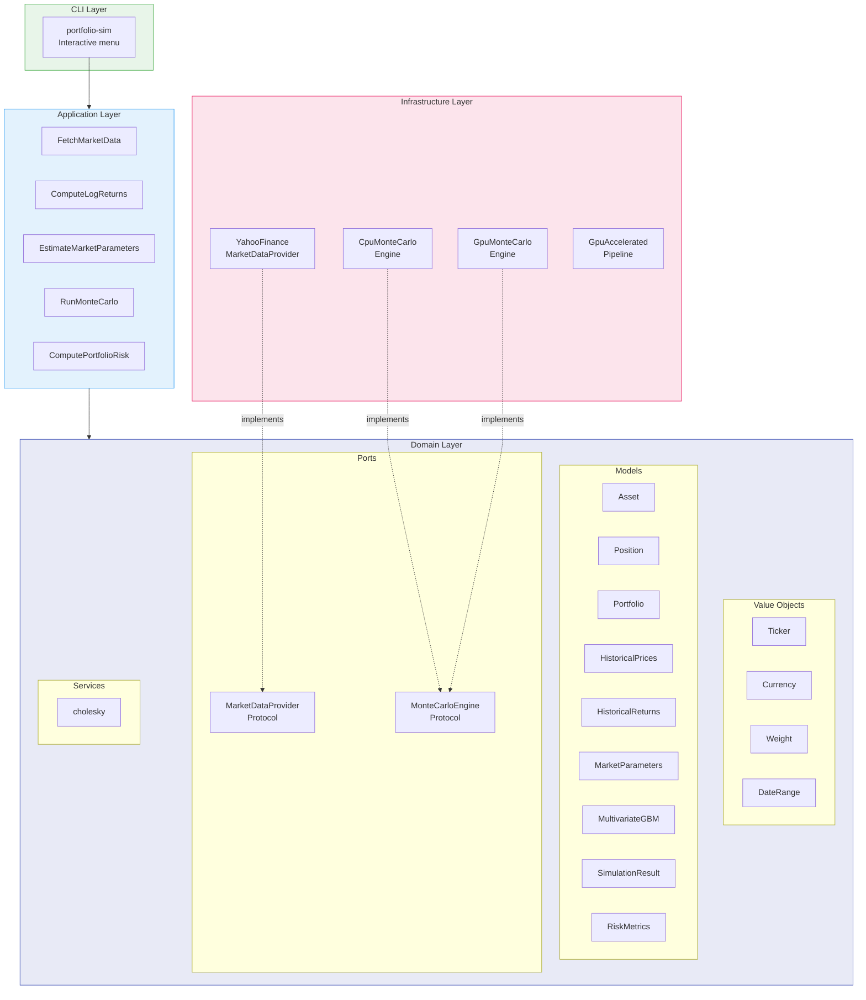
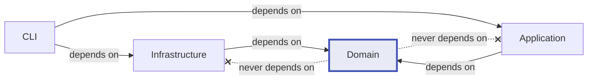
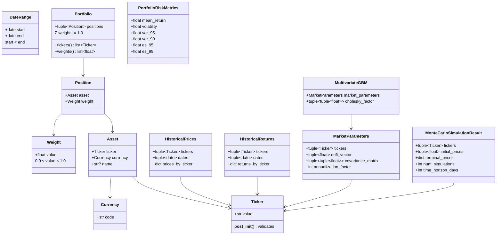
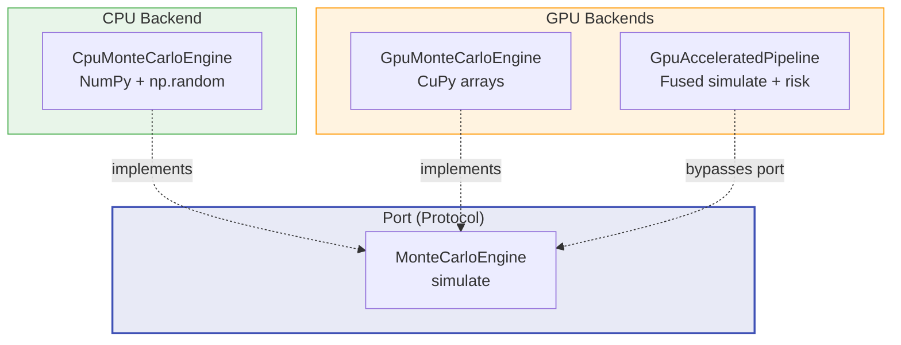

# Architecture

The Portfolio Risk Engine follows a **hexagonal (ports & adapters) architecture** with three layers. Domain logic is fully isolated from infrastructure concerns.

## Layer Overview



## Dependency Rule

Dependencies point **inward** — infrastructure and application depend on domain, never the reverse.



- **Domain** defines `Protocol` interfaces (ports) with zero external dependencies
- **Infrastructure** provides concrete implementations (adapters)
- **Application** orchestrates domain operations via use cases

## Data Pipeline

The simulation flow chains five use cases in sequence. Each use case transforms one domain model into the next:

```mermaid
flowchart LR
    A["📊 FetchMarketData"] --> B["📈 ComputeLogReturns"]
    B --> C["📐 EstimateMarket<br/>Parameters"]
    C --> D["🎲 RunMonteCarlo"]
    D --> E["⚠️ ComputePortfolio<br/>Risk"]

    A1[/"HistoricalPrices"/] --> B
    B1[/"HistoricalReturns"/] --> C
    C1[/"MarketParameters"/] --> D
    D1[/"SimulationResult"/] --> E
    E1[/"PortfolioRiskMetrics"/]

    A --> A1
    B --> B1
    C --> C1
    D --> D1
    E --> E1

    style A fill:#bbdefb
    style B fill:#bbdefb
    style C fill:#bbdefb
    style D fill:#bbdefb
    style E fill:#bbdefb
    style A1 fill:#fff9c4
    style B1 fill:#fff9c4
    style C1 fill:#fff9c4
    style D1 fill:#fff9c4
    style E1 fill:#c8e6c9
```



### Step Details

| Step | Use Case | Input | Output | Key Operation |
|------|----------|-------|--------|---------------|
| 1 | `FetchMarketData` | Tickers + DateRange | `HistoricalPrices` | Yahoo Finance API call |
| 2 | `ComputeLogReturns` | `HistoricalPrices` | `HistoricalReturns` | $r_t = \ln(S_t / S_{t-1})$ |
| 3 | `EstimateMarketParameters` | `HistoricalReturns` | `MarketParameters` | Annualized drift + covariance |
| 4 | `RunMonteCarlo` | `MarketParameters` | `MonteCarloSimulationResult` | Cholesky → GBM → terminal prices |
| 5 | `ComputePortfolioRisk` | Simulation + Portfolio | `PortfolioRiskMetrics` | Weighted returns → VaR/ES |

## Domain Model



## Compute Backends

The engine supports two execution backends through the `MonteCarloEngine` protocol:



| Backend | Library | Data Path | Best For |
|---------|---------|-----------|----------|
| `CpuMonteCarloEngine` | NumPy | CPU → tuples → CPU | Development, small-scale |
| `GpuMonteCarloEngine` | CuPy | GPU → tuples → CPU | Medium scale, compatible with domain pipeline |
| `GpuAcceleratedPipeline` | CuPy | GPU → GPU → 6 scalars | Production, large-scale (zero tuple allocation) |

The `GpuAcceleratedPipeline` fuses simulation and risk computation into a single GPU pass — only 6 scalar floats (the risk metrics) are transferred back to CPU. This avoids the overhead of materializing millions of terminal prices as Python tuples.

## Project Structure

```
src/portfolio_risk_engine/
├── domain/
│   ├── value_objects/          # Ticker, Currency, Weight, DateRange
│   ├── models/                 # Asset, Position, Portfolio, ...
│   ├── ports/                  # MarketDataProvider, MonteCarloEngine (Protocol)
│   └── services/               # cholesky()
├── application/
│   └── use_cases/              # FetchMarketData, ComputeLogReturns, ...
├── infrastructure/
│   ├── market_data/            # YahooFinanceMarketDataProvider
│   └── simulation/             # CpuMonteCarloEngine, Gpu*
├── cli.py                      # Interactive CLI (PortfolioSimulatorCLI)
└── __main__.py                 # python -m portfolio_risk_engine
```
