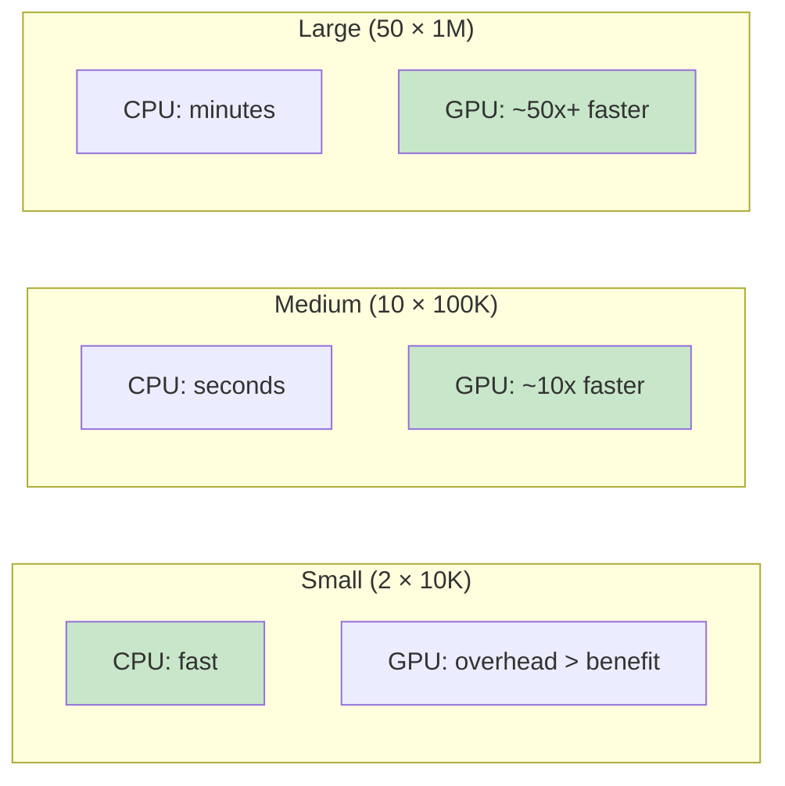

# Benchmarks

Performance comparison of CPU and GPU backends across different scales.

## Benchmark Script

Run the benchmark suite:

```bash
python scripts/benchmark_monte_carlo.py
```

This compares three pipelines end-to-end (simulation + risk computation):

| Pipeline | Description |
|----------|-------------|
| **CPU** (NumPy) | `CpuMonteCarloEngine` → tuples → `ComputePortfolioRisk` |
| **GPU via domain** (CuPy) | `GpuMonteCarloEngine` → tuples → `ComputePortfolioRisk` |
| **GPU accelerated** (CuPy) | `GpuAcceleratedPipeline` (fused, zero tuple allocation) |

Each scenario runs 5 times after a warm-up. Reports median, mean, min, max.

## Scenarios

| Scenario | Assets | Simulations | Use Case |
|----------|--------|-------------|----------|
| Small    | 2      | 10,000      | Quick validation |
| Medium   | 10     | 100,000     | Typical analysis |
| Large    | 50     | 1,000,000   | Production-scale |

## Reference Results

!!! note
    Results below are from the `v1-demo` notebook (3 assets, 50,000 paths, 252 steps, 1-year horizon). Your results will vary based on hardware.

### CPU Performance (3 assets, 50K paths)

| Metric | Value |
|--------|-------|
| Time | ~0.76 s |
| VaR 95% | 26.42 |
| ES 95% | 33.20 |

### GPU Performance (3 assets, 100K paths)

| Metric | CPU | GPU |
|--------|-----|-----|
| VaR 95% | 26.48 | 26.30 |
| ES 95% | 33.22 | 33.15 |
| Time (s) | 1.47 | 0.031 |
| **Speedup** | — | **47.2x** |

!!! info "RNG Differences"
    Small statistical differences between CPU and GPU results are expected — they use different random number generators (NumPy PCG64 vs CuPy/device RNG).

## Scaling Characteristics



### When to Use GPU

- **< 10K simulations**: CPU is typically faster (GPU launch overhead dominates)
- **10K–100K simulations**: GPU provides moderate speedups
- **> 100K simulations**: GPU provides significant speedups, especially with the fused pipeline
- **> 1M simulations**: GPU accelerated pipeline is essential (avoids allocating millions of tuples)

## Notebook Demo

The `notebooks/v1-demo.ipynb` notebook provides an interactive benchmark with:

- Loss distribution histograms with VaR/ES overlays
- Risk metrics at multiple confidence levels (90%, 95%, 99%)
- Strategy comparison (concentrated, diversified, equal-weight)
- Stress testing (normal vs crisis correlations)
- CPU vs GPU timing comparison

Run it:

```bash
jupyter notebook notebooks/v1-demo.ipynb
```

## Running Your Own Benchmarks

```python
import time
from portfolio_risk_engine.infrastructure.simulation.cpu_monte_carlo_engine import CpuMonteCarloEngine
from portfolio_risk_engine.application.use_cases.run_monte_carlo import RunMonteCarlo
from portfolio_risk_engine.application.use_cases.compute_portfolio_risk import ComputePortfolioRisk

engine = CpuMonteCarloEngine(seed=42)

start = time.perf_counter()
sim = RunMonteCarlo(engine).execute(
    market_params=params,
    initial_prices=initial_prices,
    num_simulations=100_000,
    time_horizon_days=21,
)
risk = ComputePortfolioRisk.execute(portfolio, sim)
elapsed = time.perf_counter() - start

print(f"Time: {elapsed:.3f} s")
print(f"VaR 95%: {risk.var_95:.4%}")
```
