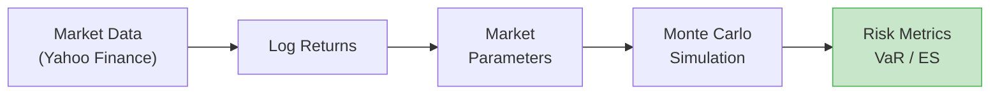

# Portfolio Risk Engine

GPU-accelerated Monte Carlo engine for simulating multi-asset portfolio dynamics and estimating risk metrics (VaR, Expected Shortfall).

## Overview

This engine simulates thousands to millions of market scenarios using **Geometric Brownian Motion** (GBM) to estimate the distribution of future portfolio values and derive downside risk measures.



### Key Features

- **Multi-asset Monte Carlo** with correlated asset dynamics (Cholesky decomposition)
- **Risk metrics**: VaR and Expected Shortfall at 95% and 99% confidence
- **Dual backends**: CPU (NumPy) and GPU (CuPy) with identical interfaces
- **GPU-accelerated pipeline**: fused simulation + risk on GPU (zero tuple allocation)
- **Real market data**: Yahoo Finance integration for historical prices
- **Hexagonal architecture**: domain logic isolated from infrastructure

## Quick Start

### Synthetic Example (No Network)

```python
from portfolio_risk_engine.domain.models.asset import Asset
from portfolio_risk_engine.domain.models.market_parameters import MarketParameters
from portfolio_risk_engine.domain.models.portfolio import Portfolio
from portfolio_risk_engine.domain.models.position import Position
from portfolio_risk_engine.domain.value_objects.currency import Currency
from portfolio_risk_engine.domain.value_objects.ticker import Ticker
from portfolio_risk_engine.domain.value_objects.weight import Weight
from portfolio_risk_engine.application.use_cases.run_monte_carlo import RunMonteCarlo
from portfolio_risk_engine.application.use_cases.compute_portfolio_risk import ComputePortfolioRisk
from portfolio_risk_engine.infrastructure.simulation.cpu_monte_carlo_engine import CpuMonteCarloEngine

# Define portfolio
portfolio = Portfolio(positions=(
    Position(asset=Asset(ticker=Ticker("AAPL"), currency=Currency("USD")), weight=Weight(0.5)),
    Position(asset=Asset(ticker=Ticker("MSFT"), currency=Currency("USD")), weight=Weight(0.3)),
    Position(asset=Asset(ticker=Ticker("GOOGL"), currency=Currency("USD")), weight=Weight(0.2)),
))

# Market parameters (drift, covariance, annualization)
params = MarketParameters(
    tickers=(Ticker("AAPL"), Ticker("MSFT"), Ticker("GOOGL")),
    drift_vector=(0.12, 0.10, 0.08),
    covariance_matrix=(
        (0.0784, 0.0252, 0.0196),
        (0.0252, 0.0324, 0.0180),
        (0.0196, 0.0180, 0.0484),
    ),
    annualization_factor=252,
)

# Simulate
engine = CpuMonteCarloEngine(seed=42)
sim = RunMonteCarlo(engine).execute(
    market_params=params,
    initial_prices=(180.0, 380.0, 140.0),
    num_simulations=50_000,
    time_horizon_days=21,
)

# Risk metrics
risk = ComputePortfolioRisk.execute(portfolio, sim)
print(f"VaR 95%: {risk.var_95:.4%}")
print(f"ES  95%: {risk.es_95:.4%}")
```

### With Real Market Data

```python
from datetime import date
from portfolio_risk_engine.application.use_cases.fetch_market_data import FetchMarketData
from portfolio_risk_engine.application.use_cases.compute_log_returns import ComputeLogReturns
from portfolio_risk_engine.application.use_cases.estimate_market_parameters import EstimateMarketParameters
from portfolio_risk_engine.infrastructure.market_data.yahoo_finance_market_data_provider import YahooFinanceMarketDataProvider
from portfolio_risk_engine.domain.value_objects.date_range import DateRange

# Fetch historical prices
provider = YahooFinanceMarketDataProvider()
prices = FetchMarketData(provider).execute(
    tickers=(Ticker("AAPL"), Ticker("MSFT"), Ticker("GOOGL")),
    date_range=DateRange(start=date(2023, 1, 1), end=date(2024, 1, 1)),
)

# Estimate parameters from history
returns = ComputeLogReturns.execute(prices)
params = EstimateMarketParameters().execute(returns)

# Then simulate and compute risk as above...
```

## CLI

An interactive menu-driven interface:

```bash
portfolio-sim
```

See [CLI Reference](user-guide/cli.md) for details.

## What's Next

- [Installation](getting-started.md) — setup the development environment
- [Simulation Pipeline](user-guide/pipeline.md) — detailed walkthrough of each step
- [Architecture](architecture.md) — hexagonal design with Mermaid diagrams
- [Glossary](glossary.md) — VaR, ES, GBM, Cholesky and other concepts
- [Benchmarks](benchmarks.md) — CPU vs GPU performance comparison
