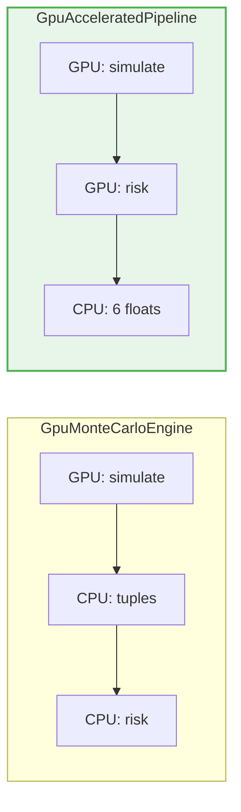

# GPU Acceleration

The engine supports GPU execution via [CuPy](https://cupy.dev/), providing significant speedups for large-scale simulations.

## Setup

### Install CuPy

Install the CuPy package matching your CUDA version:

```bash
# CUDA 12.x
pip install cupy-cuda12x

# CUDA 11.x
pip install cupy-cuda11x
```

### Verify

```python
import cupy as cp
print(f"GPUs found: {cp.cuda.runtime.getDeviceCount()}")
```

## GPU Backends

The engine provides two GPU backends:



### GpuMonteCarloEngine

Drop-in replacement for `CpuMonteCarloEngine`. Implements the `MonteCarloEngine` protocol, so it works with `RunMonteCarlo` and `ComputePortfolioRisk` use cases.

```python
from portfolio_risk_engine.infrastructure.simulation.gpu_monte_carlo_engine import GpuMonteCarloEngine

engine = GpuMonteCarloEngine(seed=42)
sim = RunMonteCarlo(engine).execute(
    market_params=params,
    initial_prices=initial_prices,
    num_simulations=1_000_000,
    time_horizon_days=21,
)
risk = ComputePortfolioRisk.execute(portfolio, sim)
```

**Trade-off**: terminal prices are transferred from GPU to CPU as Python tuples. For very large simulations (>1M paths), this conversion can be a bottleneck.

### GpuAcceleratedPipeline

Fused pipeline that keeps all data on GPU. Simulation and risk computation happen in a single pass — only 6 scalar floats (the final risk metrics) are transferred back.

```python
from portfolio_risk_engine.infrastructure.simulation.gpu_accelerated_pipeline import GpuAcceleratedPipeline

pipeline = GpuAcceleratedPipeline(seed=42)
risk = pipeline.run(
    market_params=params,
    initial_prices=initial_prices,
    weights=(0.5, 0.3, 0.2),
    num_simulations=1_000_000,
    time_horizon_days=21,
)
```

!!! tip "When to use which"
    - **`GpuMonteCarloEngine`**: when you need per-path terminal prices (e.g. for custom analytics or visualization)
    - **`GpuAcceleratedPipeline`**: when you only need the 6 risk metrics (fastest, no memory overhead)

## Performance

See [Benchmarks](../benchmarks.md) for detailed CPU vs GPU comparisons across different portfolio sizes and simulation counts.

### Key Factors

- **First call**: includes JIT compilation / kernel launch overhead (~1-2s)
- **Small simulations** (<10K paths): CPU may be faster due to GPU launch overhead
- **Large simulations** (>100K paths): GPU provides significant speedups
- **Fused pipeline**: eliminates tuple conversion overhead, especially impactful at >1M paths

## Architecture Note

The GPU backends live in the **infrastructure layer** and do not modify any domain or application logic. The `GpuMonteCarloEngine` implements the same `MonteCarloEngine` protocol as the CPU version. The `GpuAcceleratedPipeline` bypasses the protocol for maximum performance but produces the same `PortfolioRiskMetrics` domain model.
