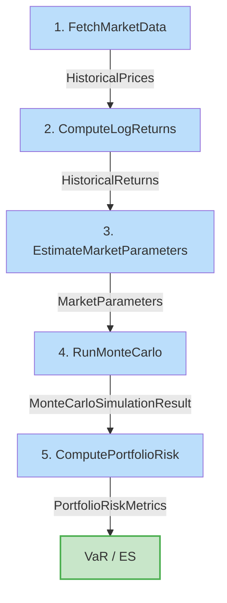
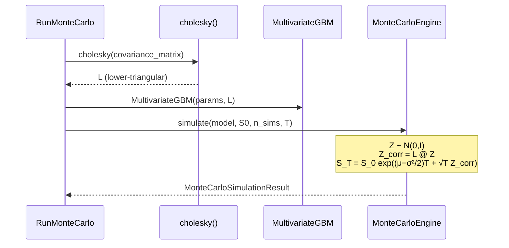

# Simulation Pipeline

The engine chains five use cases to go from raw market data to portfolio risk metrics. Each step produces an immutable domain model consumed by the next.



## Step 1: Fetch Market Data

Retrieves historical adjusted close prices from Yahoo Finance.

```python
from datetime import date
from portfolio_risk_engine.application.use_cases.fetch_market_data import FetchMarketData
from portfolio_risk_engine.infrastructure.market_data.yahoo_finance_market_data_provider import (
    YahooFinanceMarketDataProvider,
)
from portfolio_risk_engine.domain.value_objects.ticker import Ticker
from portfolio_risk_engine.domain.value_objects.date_range import DateRange

provider = YahooFinanceMarketDataProvider()
fetch = FetchMarketData(provider)

prices = fetch.execute(
    tickers=(Ticker("AAPL"), Ticker("MSFT")),
    date_range=DateRange(start=date(2023, 1, 1), end=date(2024, 1, 1)),
)

print(f"Observations: {len(prices.dates)}")
print(f"First date:   {prices.dates[0]}")
print(f"Last date:    {prices.dates[-1]}")
```

**Output**: `HistoricalPrices` — sorted dates and positive price series per ticker.

## Step 2: Compute Log Returns

Converts price series to log returns: $r_t = \ln(S_t / S_{t-1})$.

```python
from portfolio_risk_engine.application.use_cases.compute_log_returns import ComputeLogReturns

returns = ComputeLogReturns.execute(prices)

print(f"Return observations: {len(returns.dates)}")  # len(prices.dates) - 1
```

**Output**: `HistoricalReturns` — one fewer observation than prices.

## Step 3: Estimate Market Parameters

Estimates annualized drift vector $\boldsymbol{\mu}$ and covariance matrix $\Sigma$ from historical returns. The annualization factor is auto-detected from the date frequency.

```python
from portfolio_risk_engine.application.use_cases.estimate_market_parameters import EstimateMarketParameters

params = EstimateMarketParameters().execute(returns)

print(f"Annualization: {params.annualization_factor}")
for ticker, drift in zip(params.tickers, params.drift_vector):
    print(f"  {ticker.value}: μ = {drift:+.4f}")
```

**Output**: `MarketParameters` — tickers, drift vector, covariance matrix, annualization factor.

!!! info "Annualization"
    The factor is determined by the median gap between dates: 252 (daily), 52 (weekly), 12 (monthly), 4 (quarterly), or 1 (annual). See [Glossary](../glossary.md#annualization-factor).

## Step 4: Run Monte Carlo Simulation

Builds a `MultivariateGBM` model with Cholesky-decomposed covariance, then simulates terminal prices through the selected engine.

```python
from portfolio_risk_engine.application.use_cases.run_monte_carlo import RunMonteCarlo
from portfolio_risk_engine.infrastructure.simulation.cpu_monte_carlo_engine import CpuMonteCarloEngine

engine = CpuMonteCarloEngine(seed=42)
sim = RunMonteCarlo(engine).execute(
    market_params=params,
    initial_prices=(prices.prices_by_ticker[t][-1] for t in params.tickers),
    num_simulations=50_000,
    time_horizon_days=21,  # ~1 month
)

print(f"Simulations: {sim.num_simulations}")
print(f"Horizon:     {sim.time_horizon_days} trading days")
```

**Output**: `MonteCarloSimulationResult` — terminal prices per ticker per simulation path.

### How It Works



## Step 5: Compute Risk Metrics

Computes weighted portfolio returns from simulation results, then derives VaR and ES using the loss-positive convention.

```python
from portfolio_risk_engine.application.use_cases.compute_portfolio_risk import ComputePortfolioRisk
from portfolio_risk_engine.domain.models.portfolio import Portfolio
from portfolio_risk_engine.domain.models.position import Position
from portfolio_risk_engine.domain.models.asset import Asset
from portfolio_risk_engine.domain.value_objects.currency import Currency
from portfolio_risk_engine.domain.value_objects.weight import Weight

portfolio = Portfolio(positions=(
    Position(asset=Asset(ticker=Ticker("AAPL"), currency=Currency("USD")), weight=Weight(0.6)),
    Position(asset=Asset(ticker=Ticker("MSFT"), currency=Currency("USD")), weight=Weight(0.4)),
))

risk = ComputePortfolioRisk.execute(portfolio, sim)

print(f"Mean return:  {risk.mean_return:+.4%}")
print(f"Volatility:   {risk.volatility:.4%}")
print(f"VaR 95%:      {risk.var_95:.4%}")
print(f"VaR 99%:      {risk.var_99:.4%}")
print(f"ES  95%:      {risk.es_95:.4%}")
print(f"ES  99%:      {risk.es_99:.4%}")
```

**Output**: `PortfolioRiskMetrics` — 6 scalar risk measures.

!!! warning "Loss-Positive Convention"
    A positive VaR/ES value means a portfolio loss. See [Glossary](../glossary.md#loss-positive-convention).

## Full Pipeline Example

The CLI `full_pipeline` option (option 6) runs all steps sequentially:

```python
# Complete example in ~20 lines
from datetime import date
from portfolio_risk_engine.application.use_cases.fetch_market_data import FetchMarketData
from portfolio_risk_engine.application.use_cases.compute_log_returns import ComputeLogReturns
from portfolio_risk_engine.application.use_cases.estimate_market_parameters import EstimateMarketParameters
from portfolio_risk_engine.application.use_cases.run_monte_carlo import RunMonteCarlo
from portfolio_risk_engine.application.use_cases.compute_portfolio_risk import ComputePortfolioRisk
from portfolio_risk_engine.infrastructure.market_data.yahoo_finance_market_data_provider import YahooFinanceMarketDataProvider
from portfolio_risk_engine.infrastructure.simulation.cpu_monte_carlo_engine import CpuMonteCarloEngine
from portfolio_risk_engine.domain.models.asset import Asset
from portfolio_risk_engine.domain.models.portfolio import Portfolio
from portfolio_risk_engine.domain.models.position import Position
from portfolio_risk_engine.domain.value_objects.currency import Currency
from portfolio_risk_engine.domain.value_objects.date_range import DateRange
from portfolio_risk_engine.domain.value_objects.ticker import Ticker
from portfolio_risk_engine.domain.value_objects.weight import Weight

tickers = (Ticker("AAPL"), Ticker("MSFT"))

# 1. Fetch → 2. Returns → 3. Parameters
provider = YahooFinanceMarketDataProvider()
prices = FetchMarketData(provider).execute(
    tickers=tickers,
    date_range=DateRange(start=date(2023, 1, 1), end=date(2024, 1, 1)),
)
returns = ComputeLogReturns.execute(prices)
params = EstimateMarketParameters().execute(returns)

# 4. Simulate
initial_prices = tuple(prices.prices_by_ticker[t][-1] for t in params.tickers)
sim = RunMonteCarlo(CpuMonteCarloEngine(seed=42)).execute(
    market_params=params,
    initial_prices=initial_prices,
    num_simulations=50_000,
    time_horizon_days=21,
)

# 5. Risk
portfolio = Portfolio(positions=(
    Position(asset=Asset(ticker=Ticker("AAPL"), currency=Currency("USD")), weight=Weight(0.6)),
    Position(asset=Asset(ticker=Ticker("MSFT"), currency=Currency("USD")), weight=Weight(0.4)),
))
risk = ComputePortfolioRisk.execute(portfolio, sim)
```
